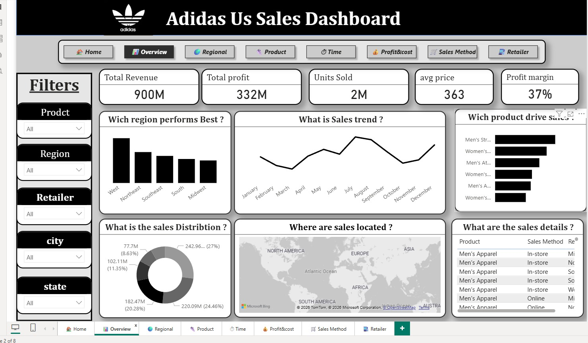

# 🏆 Adidas US Sales Analytics Dashboard

## 📊 Project Overview

تحليل شامل لمبيعات **Adidas في الولايات المتحدة** خلال الفترة 2020-2021.

### 🎯 Key Performance Indicators (KPIs)

| KPI | Value |
|-----|-------|
| 💰 **Total Revenue** | $900M |
| 📈 **Total Profit** | $332M |
| 📦 **Units Sold** | 2M |
| 💵 **Avg. Price** | $363 |
| 🎯 **Profit Margin** | 37% |

---

## 📸 Dashboard Preview

---

## 📈 Key Insights

### 1️⃣ Best Performing Region
- **أعلى منطقة مبيعات**: West & Northeast
- **أعلى ربح**: West Region ($23.3M)

### 2️⃣ Top Products by Revenue

| Product | Revenue | Profit |
|---------|---------|--------|
| Men's Street Footwear | $208.83M (27.05%) | $83M |
| Women's Apparel | $153.67M (19.91%) | $69M |
| Men's Athletic Footwear | $123.73M (16.03%) | $52M |

### 3️⃣ Sales Method Performance
- **In-store**: $356.6M (39.6%) - الأعلى إيراداً
- **Online**: $295.6M (32.85%)
- **Outlet**: $247.7M (27.52%)

### 4️⃣ Top Retailers

| Retailer | Total Units | Total Profit |
|----------|-------------|--------------|
| West Gear | 625,262 | $85.67M |
| Foot Locker | 604,369 | $80.72M |
| Sports Direct | 557,640 | $74.33M |

---

## 🛠️ Tools Used

- **Python 3.9**
- **Pandas** -数据处理
- **Matplotlib / Seaborn** - التصور البياني
- **Jupyter Notebook** - التحليل التفاعلي

---

## 📁 Project Structure
